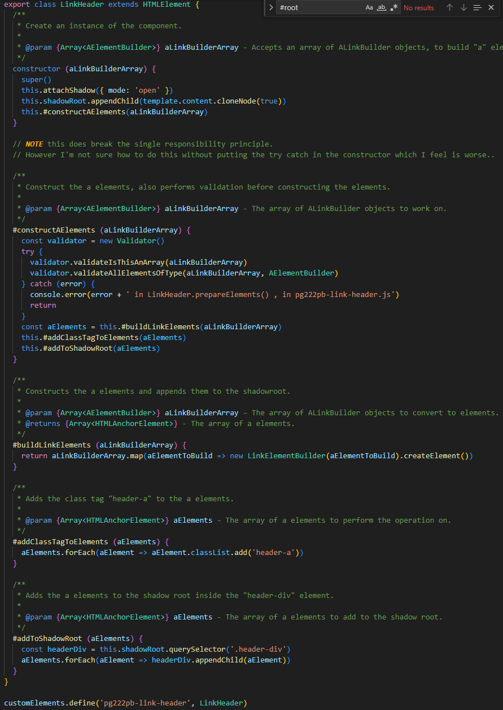

# FUTURE REFLECTION

## Chapter 6

Decided to make a class for building an "a" element. I wanted to create a more general header which would build any number of "a" elements. This required me to make a data structure which held the fields required to build it. I originally considered simply making it an anonymous object, however since that would make it hard for the caller to know what to pass, as well as make error handling hard I decided to make a class out of it. The class only consists of 2 fields and they both have getters, which I suppose breaks against the "Data Abstraction" rule, which is to hide the implementation, but as the job of the class is to act as a Data Structure rather than a proper object I feel like this is acceptable. Especially as it does not have any setters.

// TODO IMAGES!!!

## Chapter 7

As I was working I decided to refactor my code in my LinkHeader class, I broke out some validation methods into their own seperate class and decided to throw the error there rather than in the class itself. I then quickly realized that it would become a lot harder to see where the error actually occured, in accordance with the rule "Provide Context with Exceptions". I already had a "handleError" method in this class. (For context the errors thrown in this class are only relevant to the developer). At this point I realized that an end user may not want or need this problem rendered in the UI and simply removed the #handleError function and opted to simply console.error() the error for testing in my try catch with the addition of the filename and the method that the try catch is located in. The try catch encapsulates more than I would like.

// TODO are all the error messages set inside the controller/view and not in the model?
// NOTE model should only throw?

How the handleError method looked before refactoring.

How the validation occured before the refactoring

Created a try-catch that returns should an error be thrown.

## Chapter 8

I am certain that I have missed a few points in my code where the applicability is similar but, I decided to try to take the "minimze impact of change" to heart, hence why I in my Validator class decided to wrap the "isArray" in my own API. (As this is a class that I can see myself reusing I also don't feel like it matters to much whether this particular function was reused in this project). Benefit obviously being that if the isArray function for some ungodly reason would change in the future this is the only place in the project where a change would have to occur. (I am aware that making the methods static breaks against OOP convention/rules(?) however I did not feel like it made much sense to have to declare a Validator as an object everytime I wanted to use it, this simply looks cleaner).

## Chapter 9

I decided to follow a TTD, where I wrote tests right before the implementation code. This worked quite well, especially for the few automatic tests I wrote, as I was refactoring my code after writing it for the first time to see that it worked. This made the refactoring process a lot easier as I could quite easily tell whether something worked or not by simply running the test.

// TODO expand on this

## Chapter 10

The private methods in link.header.js are listed in the order that they are called from top-down. This kind of adheres to the public>private rule talked about in this chapter.
I do not believe that my PageController fulfills the SRP, as it builds and renders the Header as well as handles the rendering of the Page components. It also lacks cohesion as the page fields are only used in their specific callbacks. I decided on this structure due to other one I had making it difficult to achieve the "swapping" of components, and instead reloaded the entire page (i wanted it to be more like React). I am aware of this flaw but decided to keep it anyway. I would have liked to use abstractions more, by for example implementing the Observer pattern instead of sending out events to listen to, however Javascript does not support interfaces. One example is in the `SimpleDateConversionPage` where I would have liked to send it in as an Observer into the `SmallDateConverter`, instead of relying on the "convert" event that is fired inside `SmallDateConverter`. As, should the event name change it would also have to change in `SimpleDataConversionPage`. Essentially, there's a hidden dependency here which could have been avoided.

The functions are declared in the order that they are called.

The listener that has a hidden dependency to "convert".

The event being fired.

### Overall

I WISH I WAS WRITING TYPESCRIPT RIGHT NOW

Had to think quite hard, since my model ended up depending on the calendars listed in the view, i.e the names of the calendars. To avoid this I created a list of acceptable calendars and their "name". I want to render this in the view but not sure about how to do it as my validator is kinda scuffed now...