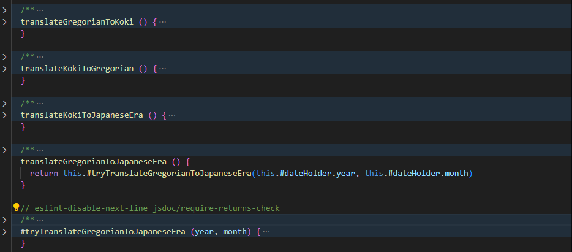

# Reflections Clean Code

## Sidenote

I would have liked to use OOP concepts more such as interfaces and abstract classes to better adhere to things such as DRY and just general file structure, however you cannot create interfaces or abstract classes in Javascript, only Typescript...

Not entirely sure how to avoid the duplication of the #dateHolder field as moving this field up the class hierarchy would add an immense amount of complexity to the class hierarchy since Javascript does not support protected fields and only private/public.

## Chapter 2

I've tried to give all my variable names meaningful and unique names, the unique names to make them more searchable. The one place I ran into issues was in the `Transformer` classes where very similar operations are performed with only slight differences, I added some more context to the names as can be seen below however as these specific variables are not likely to be searched for specifically as in this context the algorithm itself is more likely to be of interest rather than the specific variable names, in this regard the method names are aptly named in my opinion as they clearly state the format of date which is being worked on.

Initially I did not follow the One Word Per Concept in the `Transformer` and `TemporalConverterWrapper` classes either as the methods in both classes shared the word `convert` while performing different things. Therefore one of these concepts had to be renamed and I selected // TODO

// TODO rename the method names to not all be convert

The names that were poor

The updated names, the `convert` issue is also visible here in the DateConverter

The method names sharing `convert` in the `TemporalConverterWrapper` class.

## Chapter 3

I've done a reasonably good job at not mixing the abstraction levels of my functions, the essence of this rule is to keep things non-confusing and the author Robert, states that mixing them is always confusing. I have conciously violated this rule in my `convertKokiToJapaneseEra` function, seen below, where the operation to split the returned string is of medium level abstraction. It is a concious choice as I feel like the operation is simple enough and the variable names clear enough for this to not cause confusion. I believe a worse offense would have been to perform a low level operation in a high abstraction method, such as also including the following try/catch in this statement
(although this would have violated other rules aswell).

Furthermore in accordance with the rule of extracting try/catch blocks, this has been done wherever possible. While this makes the code a lot easier to understand it also makes the handling of the error substantially easier, as the error is handled closer to where it was thrown, compared to how I was previously handling them, while also keeping the number of try/catches to a minimum. This also synergizes with the rule of DRY, as the error handling and catching is now done in one place, and one place only.

The mixing of abstraction levels in the `convertKokiToJapaneseEra` function.

Found in [temporalconverterwrapper.js](./src/model/TemporalConverterUtils/TemporalConverterWrapper.js)

## Chapter 4

I am aware that JSDOC goes against the superflous comments rule or whatever, however I feel like this stands in contrast to the code standard followed by my fellow students @lnu-eslint-config or w/e

//TODO - talk about this

## Chapter 6

Decided to make a class for building an "a" element. I wanted to create a more general header which would build any number of "a" elements. This required me to make a data structure which held the fields required to build it. I originally considered simply making it an anonymous object, however since that would make it hard for the caller to know what to pass, as well as make error handling hard I decided to make a class out of it. The class only consists of 2 fields and they both have getters, which I suppose breaks against the "Data Abstraction" rule, which is to hide the implementation, but as the job of the class is to act as a Data Structure rather than a proper object I feel like this is acceptable. Especially as it does not have any setters.

// TODO IMAGES!!!

## Chapter 7

As I was working I decided to refactor my code in my LinkHeader class, I broke out some validation methods into their own seperate class and decided to throw the error there rather than in the class itself. I then quickly realized that it would become a lot harder to see where the error actually occured, in accordance with the rule "Provide Context with Exceptions". I already had a "handleError" method in this class. (For context the errors thrown in this class are only relevant to the developer). At this point I realized that an end user may not want or need this problem rendered in the UI and simply removed the #handleError function and opted to simply console.error() the error for testing in my try catch with the addition of the filename and the method that the try catch is located in.

Furthermore I opted to set

// TODO are all the error messages set inside the controller/view and not in the model?
// NOTE model should only throw?

How the handleError method looked before refactoring.

How the validation occured before the refactoring

// TODO this needs to be remade

Created a try-catch that returns should an error be thrown.

## Chapter 8

I am certain that I have missed a few points in my code where the applicability is similar but, I decided to try to take the "minimze impact of change" to heart, hence why I in my Validator class decided to wrap the "isArray" in my own API. (As this is a class that I can see myself reusing I also don't feel like it matters to much whether this particular function was reused in this project). Benefit obviously being that if the isArray function for some ungodly reason would change in the future this is the only place in the project where a change would have to occur. (I am aware that making the methods static breaks against OOP convention/rules(?) however I did not feel like it made much sense to have to declare a Validator as an object everytime I wanted to use it, this simply looks cleaner).

In vein with what I mentioned earlier I refactored my code to hold the DateStringBuilder object inside my TemporalConverterWrapper class, I thought this made sense as a change in how the TemporalConverter class returns its dates would require a change in logic in the DateStringBuilder class. Keeping it close to the TemporalConverter class makes it easier to see that they are related and that a change in one may require a change in the other.

// TODO add image of how the class looks like now.

## Chapter 9

I decided to follow a TTD, where I wrote tests right before the implementation code. This worked quite well, especially for the few automatic tests I wrote, as I was refactoring my code after writing it for the first time to see that it worked. This made the refactoring process a lot easier as I could quite easily tell whether something worked or not by simply running the test. The book also pressed that the test code should follow the same standard as the production code, I did not write that many automatic tests, however, I made a concious effort to group concepts/related tests together. Example being I grouped tests that SHOULD throw next to eachother.

// TODO expand on this

## Chapter 10

I do not believe that my PageController fulfills the SRP, as it builds and renders the Header as well as handles the rendering of the Page components. It also lacks cohesion as the page fields are only used in their specific callbacks. I decided on this structure due to the  other one I had making it difficult to achieve the "swapping" of components, and instead reloaded the entire page (i wanted it to be more like React). I am aware of this flaw but decided to keep it anyway. I would have liked to use abstractions more, by for example implementing the Observer pattern instead of sending out events to listen to, however Javascript does not support interfaces. One example is in the `SimpleDateConversionPage` where I would have liked to send it in as an Observer into the `SmallDateConverter`, instead of relying on the "convert" event that is fired inside `SmallDateConverter`. As should the event name change it would also have to change in `SimpleDataConversionPage`. Essentially, there's a hidden dependency here which could have been avoided.

My classes has, where it's applicable followed the guideline of public>private>public for methods and fields, where the public method is imemdiately followed by any private method it uses. I have previously tried to put my public functions at the top and all my private functions at the bottom. However this way of doing it makes it a lot easier to grasp the full context and details of any given function. This is also supported by the rule "Vertical Distance" found in chapter 5, which states the following: `Dependent Functions. If one function calls another, they should be vertically close, and the caller should be above the callee, if at all possible`.

I am not entirely sure how to treat methods called from the constructor, for example I have in my DateConverter class that calls several validation methods, which is placed in the constructor, should this be right below the constructor? This to me breaks the public>private>public pattern as the first method would then be a private method, therefore I simply opted to put it at the bottom. [Link to the class in question](./src/model/DateConverter.js)

The listener that has a hidden dependency to "convert".

The event being fired.

Example of public>private>public methods.

### Overall

I WISH I WAS WRITING TYPESCRIPT RIGHT NOW
