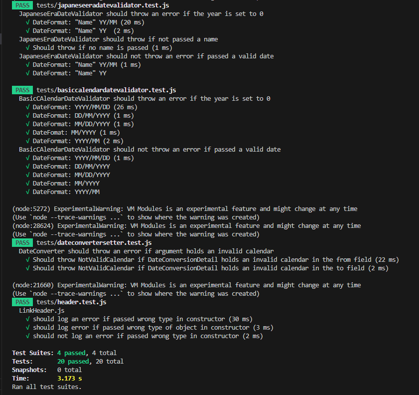

# Test report

* Date Performed: 2023-10-23
* Version: [62bb844ef264421c6af8c38455f88a0a4505d9e5](https://github.com/IchanP/L3-DateConverter/tree/62bb844ef264421c6af8c38455f88a0a4505d9e5)
* Browser: Chrome Version 118.0.5993.89

## Manual Test Report

| Test | Description               | PASS/FAIL | Note |
|------|---------------------------|------------------|-----------|
| [TC1](./testspecification.md#tc-1-page-rendering)  | **`Page Rendering`** | <span style="color: green">ALL PASS</span> | |
| [TC 1.1](./testspecification.md#tc-11-the-front-page-should-render-on-application-start) | The front page should render on application start. |  <span style="color: green">PASS</span>  |  |
| [TC 1.2](./testspecification.md#tc12-clicking-the-big-conversion-page-link-in-the-header-should-render-the-second-page) | Clicking the Big Conversion Page link in the header should render the second page |  <span style="color: green">PASS</span>  |  |
| [TC1.3](./testspecification.md#tc13-clicking-the-small-date-conversion-page-link-in-the-header-should-render-the-third-page) | Clicking the Small Date Conversion Page link in the header should render the third page | <span style="color: green">PASS</span> | |
| [TC2](./testspecification.md#tc-2-error-rendering-on-small-date-conversion-page) | **``Error Rendering on Small Date Conversion Page``** | <span style="color: green">ALL PASS</span> | |
| [TC2.1](./testspecification.md#tc21-user-should-be-informed-of-same-calendar-errors) | User should be informed of same calendar errors | <span style="color: green">PASS</span> | |
| [TC2.2](./testspecification.md#tc22-user-should-be-informed-of-invalid-date-format-errors) | User should be informed of invalid date format errors | <span style="color: green">PASS</span> | |
| [TC2.3](./testspecification.md#tc23-user-should-be-informed-of-invalid-date-when-converting-from-gregorian-to-japanese-era) | User should be informed of invalid date when converting from Gregorian to Japanese Era | <span style="color: green">PASS</span> | |
| [TC2.4](./testspecification.md#tc24-user-should-be-informed-if-the-japanese-era-name-is-invalid) | User should be informed if the Japanese Era name is invalid | <span style="color: green">PASS</span> | |
| [TC2.5](./testspecification.md#tc25-user-should-be-informed-if-the-japanese-era-year-is-invalid) | User should be informed if the Japanese Era year is invalid | <span style="color: green">PASS</span> | |
| [TC3](./testspecification.md#tc-3---date-formats-for-western-calendar-types) | **`Date Formats for Western Calendar Types`** | <span style="color: green">ALL PASS</span> | |
| [TC3.1](./testspecification.md#tc31-user-should-be-able-to-convert-using-mmyyyy-format) | User should be able to convert using `MM/YYYY` format | <span style="color: green">PASS</span> | |
| [TC3.2](./testspecification.md#tc-32-user-should-be-able-to-convert-using-yyyymm-format) | User should be able to convert using `YYYY/MM` format | <span style="color: green">PASS</span> | |
| [TC3.3](./testspecification.md#tc33-user-should-be-able-to-convert-using-mmddyyyy-format) | User should be able to convert using `MM/DD/YYYY` format | <span style="color: green">PASS</span> | |
| [TC3.4](./testspecification.md#tc34-user-should-be-able-to-convert-using-ddmmyyyy-format) | User should be able to convert using `DD/MM/YYYY` format | <span style="color: green">PASS</span> | |
| [TC3.5](./testspecification.md#tc35-user-should-be-able-to-convert-using-yyyymmdd-format) | User should be able to convert using `YYYY/MM/DD` format | <span style="color: green">PASS</span> | |
| [TC4](./testspecification.md#tc4-user-should-be-able-to-convert-to-japanese-era-using-the-small-date-converter) | **`User should be able to convert to Japanese Era using the Small Date Converter`** | <span style="color: green">ALL PASS</span> | |
| [TC4.1](./testspecification.md#tc41-user-should-be-able-to-convert-from-gregorian-to-japanese-era) | User should be able to convert from Gregorian to Japanese Era | <span style="color: green">PASS</span> | |
| [TC4.2](./testspecification.md#tc42-user-should-be-able-to-convert-from-kõki-to-japanese-era) | User should be able to convert from Kõki to Japanese Era | <span style="color: green">PASS</span> | |
| [TC5](./testspecification.md#tc5-date-formats-for-japense-calendar-style) | **`Date Formats for Japense Calendar style`** | <span style="color: green">ALL PASS</span> | |
| [TC5.1](./testspecification.md#tc51-user-should-be-able-to-convert-using-eraname-yy-format) | User should be able to convert using EraName YY format | <span style="color: green">PASS</span> | |
| [TC5.2](./testspecification.md#tc52-user-should-be-able-to-convert-using-eraname-yymm-format) | User should be able to convert using EraName YY/MM format | <span style="color: green">PASS</span> | |
| [TC6](./testspecification.md#tc6-user-should-be-able-to-convert-to-kõki-using-the-small-date-converter) | **`User should be able to convert to Kõki using the Small Date Converter`** | <span style="color: green">ALL PASS</span> |  |
| [TC6.1](./testspecification.md#tc61-user-should-be-able-to-convert-from-gregorian-to-kõki) | User should be able to convert from Gregorian to Kõki | <span style="color: green">PASS</span> | |
| [TC6.2](./testspecification.md#tc62-user-should-be-able-to-convert-from-japanese-era-to-kõki) | User should be able to convert from Japanese Era to Kõki | <span style="color: green">PASS</span> | |
| [TC.7](./testspecification.md#tc7-user-should-be-able-to-convert-to-gregorian-using-the-small-date-converter) | **`User should be able to convert to Gregorian using the Small Date Converter`** | <span style="color: green">ALL PASS</span> | |
| [TC7.1](./testspecification.md#tc71-user-should-be-able-to-convert-from-kõki-to-gregorian) | User should be able to convert from Kõki to Gregorian | <span style="color: green">PASS</span> | |
| [TC7.2](./testspecification.md#tc72-user-should-be-able-to-convert-from-japanese-era-to-gregorian) | User should be able to convert from Japanese Era to Gregorian | <span style="color: green">PASS</span> | |
| [TC8](./testspecification.md#tc8-user-should-be-informed-of-possible-date-formats) | **`User should be informed of possible date formats`** | <span style="color: green">ALL PASS</span> | |
| [TC8.1](./testspecification.md#tc81-user-should-be-informed-of-possible-date-formats-on-the-small-date-conversion-page) | User should be informed of possible date formats on the Small Date Conversion Page | <span style="color: green">PASS</span> | |
| [TC8.2](./testspecification.md#tc82-user-should-be-informed-of-possible-date-formats-on-the-big-text-conversion-page) | User should be informed of possible date formats on the Big Text Conversion Page | <span style="color: green">PASS</span> | |
| [TC9](./testspecification.md#tc9-user-should-be-able-to-convert-to-japanese-era-using-the-big-text-converter) | **`User should be able to convert to Japanese Era using the Big Text Converter`** | <span style="color: green">ALL PASS</span> | |
| [TC9.1](./testspecification.md#tc91-user-should-be-able-to-convert-from-gregorian-to-japanese-era) | User should be able to convert from Gregorian to Japanese Era | <span style="color: green">PASS</span> | |
| [TC9.2](./testspecification.md#tc92-user-should-be-able-to-convert-from-kõki-to-japanese-era) | User should be able to convert from Kõki to Japanese Era | <span style="color: green">PASS</span> | |
| [TC10](./testspecification.md#tc10-user-should-be-able-to-convert-from-western-calendar-types-using-many-different-formats-using-the-big-text-converter) | **`User should be able to convert from Western Calendar types using many different formats`** | <span style="color: green">ALL PASS</span> | |
| [TC10.1](./testspecification.md#tc101-user-should-be-able-to-convert-from-kõki-to-gregorian-using-many-different-formats) | User should be able to convert from Kõki to Gregorian using many different formats | <span style="color: green">PASS</span> | |
| [TC10.2](./testspecification.md#tc102-user-should-be-able-to-convert-from-gregorian-to-japanese-era-using-many-different-formats) | User should be able to convert from Gregorian to Japanese Era using many different formats | <span style="color: green">PASS</span> | |
| [TC11](./testspecification.md#tc11-user-should-be-able-to-convert-to-kõki-using-the-big-text-converter) | **`User should be able to convert to Kõki using the Big Text Converter`** |  <span style="color: green">ALL PASS</span> | |
| [TC11.1](./testspecification.md#tc111-user-should-be-able-to-convert-from-gregorian-to-kõki) | User should be able to convert from Gregorian to Kõki |  <span style="color: green">PASS</span> | |
| [TC11.2](./testspecification.md#tc112-user-should-be-able-to-convert-from-japanese-era-to-kõki) | User should be able to convert from Japanese Era to Kõki |  <span style="color: green">PASS</span> | |
| [TC12](./testspecification.md#tc12-user-should-be-able-to-convert-to-gregorian-using-the-big-text-converter) | **`User should be able to convert to Gregorian using the Big Text Converter`** | <span style="color: green">ALL PASS</span> | |
| [TC12.1](./testspecification.md#tc121-user-should-be-able-to-convert-from-kõki-to-gregorian) | User should be able to convert from Kõki to Gregorian |  <span style="color: green">PASS</span> | |
| [TC12.2](./testspecification.md#tc122-user-should-be-able-to-convert-from-japanese-era-to-gregorian) | User should be able to convert from Japanese Era to Gregorian |  <span style="color: green">PASS</span> | |
| [TC13](./testspecification.md#tc13-user-should-be-able-to-copy-the-converted-date) | **`User should be able to copy the converted date`** | <span style="color: green">ALL PASS</span> | |
| [TC13.1](./testspecification.md#tc131-user-should-be-able-to-copy-the-converted-date-on-the-small-date-conversion-page) | User should be able to copy the converted date on the Small Date Conversion Page | <span style="color: green">PASS</span> | |
| [TC13.2](./testspecification.md#tc132-user-should-be-able-to-copy-the-converted-date-on-the-big-text-conversion-page) | User should be able to copy the converted date on the Big Text Conversion Page | <span style="color: green">PASS</span> | |
| [TC14](./testspecification.md#tc14-user-should-be-informed-of-user-errors-on-the-big-text-conversion-page) | **`User should be informed of user errors on the Big Text Conversion Page`** |  <span style="color: green">ALL PASS</span> | |
| [TC14.1](./testspecification.md#tc141-user-should-be-informed-of-same-calendar-erors) | User should be informed of same calendar erors |  <span style="color: green">PASS</span> | |
| [TC15](./testspecification.md#tc15-user-should-be-able-to-convert-from-japanese-era-using-many-different-formats) | **`User should be able to convert from Japanese Era using many different formats`** | <span style="color: green">ALL PASS</span> | |
| [TC15.1](./testspecification.md#tc151-user-should-be-able-to-convert-from-japanese-era-to-gregorian-using-many-different-formats) | User should be able to convert from Japanese Era to Gregorian using many different formats | <span style="color: green">PASS</span> | |

## Automatic tests



Automatic tests ran on 2023-10-23 at 00:27

### How to run

To run these tests locally simply fork or download this repository, install the dependencies and run:

``` commandline
npm run test
```
